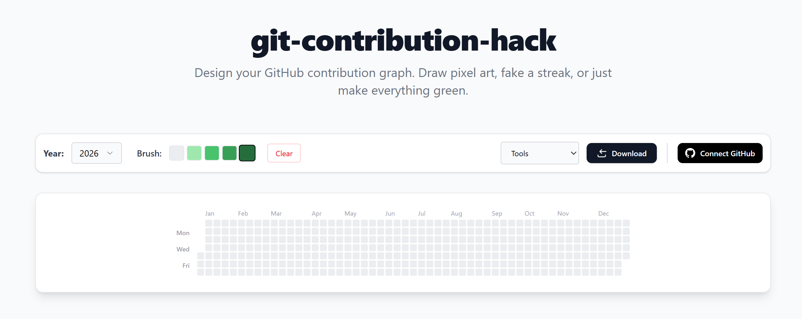
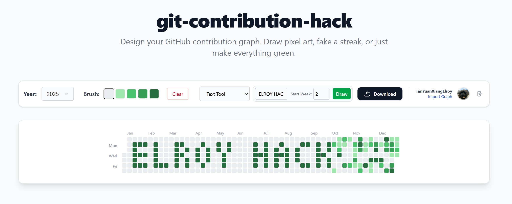

# Git Contribution Hack

  

**Design your GitHub contribution graph. Draw pixel art, write text, or fake a streak.**

[**Live Demo**](https://git-contribution-hack.vercel.app/) 



## 💡 Inspiration & The "Why"

This project was inspired by **[Fenrir YouTube video](https://youtu.be/LlkcvvGbs9I?si=NcSFxcDigy60thlU)** on hacking the git serise.

**Why I built this:**
When I looked for tools to customize the contribution graph, most were simple Command Line Interfaces (CLI) or Python scripts. 

They had major limitations:
1.  **"Blind" Editing:** You couldn't see what the result would look like until you pushed code.
2.  **No History:** You couldn't see your *existing* commits, meaning you might accidentally overwrite or mess up your actual work history.
3.  **Poor UX:** There was no easy way to type text or drag-and-drop patterns.

If they had UI it was pretty bad if it was good it was under a paywall

**Git Contribution Hack** solves this by providing a reactive, visual UI that imports your actual data and lets you design around it.


## Features

*   **Visual Editor:** Click and drag to paint your commit history (0-4 intensity).
*   **Import History:** Log in with GitHub to see your *real* graph and paint around existing commits you also can't pain a lower colour than what is already imported.
*   **Text Tool:** Type text like "HELLO" or use Emojis (`:)`, `😊`) to generate pixel art instantly.
*   **Script Export:** Generates a safe bash script (`.sh`) to create the commits locally.

---

## 📸 Screenshots

### The Editor


---

##  How to Use

### 1. Design Your Graph
Go to the website, select the year, and start painting. You can use the **Text Tool** to write messages or the **Brush** to draw manually.

### 2. Export the Script
Click **Download Script**. You will get a file named `git-art.sh`.

### 3. Run it Safely (The "Disposable Repo" Method)
**⚠️ WARNING:** Do not run this inside your actual work or project repositories. It generates hundreds of empty commits.

1.  Create a **New, Empty Repository** on GitHub (e.g., `my-art-repo`).
2.  Create a new folder on your computer and move the script there.
3.  Open your terminal in that folder.

**For Mac/Linux:**
```bash
chmod +x git-art.sh
./git-art.sh
```
**For Windows (Git Bash):**

```Bash
./git-art.sh
```
**Push to GitHub**

Once the script finishes generating the commits:
```Bash
git remote add origin https://github.com/YOUR_USERNAME/my-art-repo.git
git branch -M main
git push -u origin main
```
Wait 10-30 seconds, refresh your GitHub profile, and enjoy your art! 

##  Local Development
Want to add new patterns or icons?

**Clone the repo**

```Bash
git clone https://github.com/TanYuanXiangElroy/git-contribution-hack.git
cd git-contribution-hack
Install dependencies
```
```Bash
npm install
```
**Setup Environment Variables** (If you want to do the git history import localy)
Create a `.env.local` file:

```Bash
GITHUB_ID=your_oauth_client_id
GITHUB_SECRET=your_oauth_client_secret
NEXTAUTH_URL=http://localhost:3000
NEXTAUTH_SECRET=any_random_string
```
---
### 🔑 How to get GitHub OAuth Keys

To allow the "Connect GitHub" button to work locally, you need to register a developer app with GitHub.

<details>
<summary><strong>Click to show step-by-step instructions</strong></summary>

1.  Log in to GitHub.
2.  Go to setting at the top right
3.  Then at the bottom left **[Developer Settings > OAuth Apps](https://github.com/settings/developers)**.

4.  Click **"New OAuth App"**.
5.  Fill in the form with these exact details for `local testing`:
    *   **Application Name:** `Git Contribution Hack (Local)`
    *   **Homepage URL:** `http://localhost:3000`
    *   **Authorization callback URL:** `http://localhost:3000/api/auth/callback/github`
6.  Click **Register application**.
7.  On the next screen:
    *   Copy the **Client ID** → paste this as `GITHUB_ID` in your `.env.local`.
    *   Click **Generate a new client secret**.
    *   Copy the **Client Secret** → paste this as `GITHUB_SECRET` in your `.env.local`.
    * `NEXTAUTH_SECRET` can be any long string

</details>


---
**Run the server localy**

```Bash
npm run dev
```
### 👾 How to Add New Icons/Emojis
The text tool relies on a bitmap dictionary. You can easily add new icons like an Alien (👾).

1. Open src/utils/letters.ts.
2. Find the ALPHABET object.
3. Add your new character. The logic is based on Columns (Vertical).
    - 1 = Pixel On (Green)
    - 0 = Pixel Off (Empty)

**Example: Adding an Alien**

```typescript
// In src/utils/letters.ts
  
  "👾": [
    [0,0,1,0,0], // Column 1 (Left Antenna)
    [0,1,1,1,0], // Column 2
    [1,1,0,1,1], // Column 3 (Middle/Eyes)
    [0,1,1,1,0], // Column 4
    [0,0,1,0,0], // Column 5 (Right Antenna)
  ],
```
p.s. If you want to map a symbol (like !) to this icon, update the ALIASES object at the bottom of the file.

## Future Roadmap / To-Do

Here are some stuff I would love help on or will slowly add this when I have more bandwidth/remember

- [ ] **More Patterns**: Examples would be "Checkerboard", "Waves", etc.

- [ ] **Dark Mode**: Support system dark mode for the UI.

- [ ] **Advanced Text Styling:** Allow users to select the specific brush intensity (Level 1-4) for text/emojis, instead of defaulting to dark green.
- [ ] **Texture Fills:** Add patterns *inside* the text/icons (e.g., Camouflage, Gradients, or Noise) so they aren't just solid blocks of color.

- [ ] **Direct Integration**: Use GitHub API to push commits directly without downloading a script (requires background jobs). [How to make it free/cheap and at a quick time would be a challange]


# ⚠️ Disclaimer

* This tool is for **educational** and *aesthetic* purposes only.
* Do not use this to deceive employers or lie about your work history.
* Commits are generated with `--allow-empty`, so no actual code is changed, but it will clutter your commit history list.

**Always use a private, disposable repository.**


Built using Next.js, Tailwind CSS, GitHub GraphQL API and AI 😉.